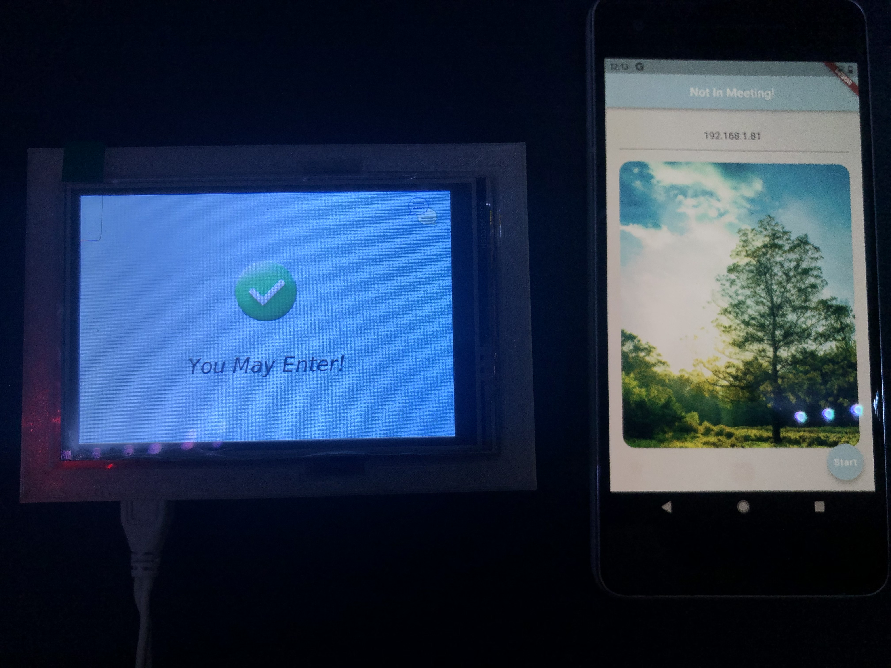
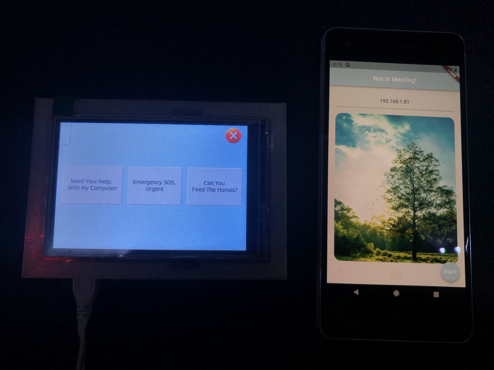
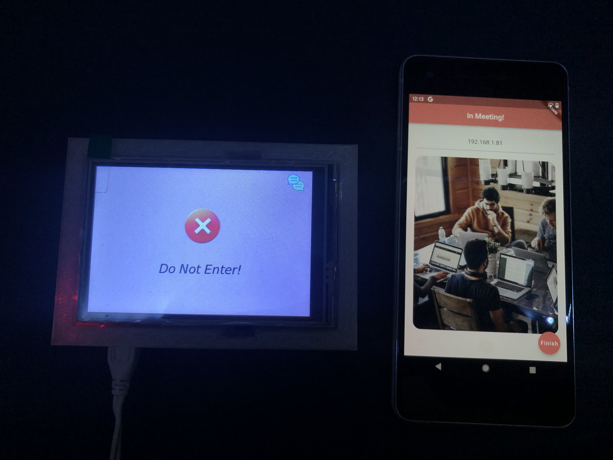
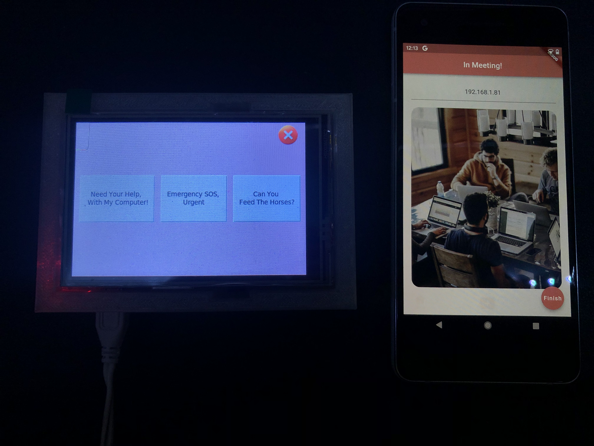

# Welcome

This project is a meeting notification semi-IOT / Mobile Intergration APP. Where the semi-IOT device is place outside a room and is able to be
controlled via a mobile app. The goal of this project was to reduce the number of disruptions I would have occured during at home online meetings.
The source code is split into two sections first ***"traffic_light_app"*** which was build with flutter and has been testing with the android emulator and
a pysical pixel 2 device, further build build commands can be found in the readme.md file inside this folder.
The second is ***"traffic_light_r_pi_code"*** which is code base that is install on the raspberry pi, this contains python code namely that used to create a flask
server and tkinter app for the ui. The following screen shots show a highlevel of the system.

  
   
   
  
  

## Current Features

* Mobile UI Build With Flutter.
* API Layer Build With Flask.
* R-PI GUI Build With Tkinter.
* Email Notificaiton / Messaging Build With Gmail API.

## Furture Work Options

The goal of this project was to create a basic IOT device that would be able to indicate whether a meeting was taking place.
That being said there are a may other options to expand this system and here a simple list of some options.

### Traffic Light App (Mobile)

* Notifications - Making Use Of Firebase Messaging.
* Dynamic IP Address Checking On Startup and Alert Message When Connection Can Not Be Made.
* Check Requst From API & If Invalid Display Error Message on Screen.

### Traffic Light Raspberry PI Code

* Screen Dimming For When Outside Of Active Hours To Save On Power Usage.
* UI For Editing & View Settings On Device (Could Be Password Protected).
* Error Message Management / Alert Elements For UI.
* Link To Google Calendar To Update Meeting Status Dynamically.
* Options For SMS Notification Over Email or Local Notifications.
* Door Locking Control Unit - Whereby the door would lock automatically when in meeting.
* Solar Powered.

## Parts I used

* Raspberry PI 3 Model B
* ELEGOO 3.5 Inch TFT LCD 480x320 Screen - [DOCs](https://www.elegoo.com/en-gb/blogs/arduino-projects/elegoo-3-5-inch-touch-screen-for-raspberry-pi-manual)
* Flashforge Adventurer 3 - 3D Printer
* Pixel 2 - For Testing & Controlling UI

## Setup:

1. Have R-PI running with an OS of your choosing as long as its capable of running python3. Set to static IP Address (Optional) - [Link](https://www.tomshardware.com/how-to/static-ip-raspberry-pi)
2. Install Code Base Onto R-PI into relavent folder for you. If you wish to automate this process take a look at: *Pro Deployer - SFTP/FTP* for this you will need to setup / enable SSH on pi.
3. Set both *"flaskApp.py* & *"main.py"* to autorun on pi startup - [Useful](https://www.dexterindustries.com/howto/run-a-program-on-your-raspberry-pi-at-startup/#:~:text=txt%202%3E%261-,Method%202%3A%C2%A0.bashrc,-The%20second%20method)
4. Follow the following setup guide to setup screen on pi. - [Link](
https://trickiknow.com/raspberry-pi-3-complete-tutorial-2018-lets-get-started/#:~:text=Open%20terminal%20in%20Raspbian%20desktop%2C%20and%20type%20the%20following%20commands.)
4. Restart PI & You Should Be Set.
5. Inrelation to Flutter this is a started process and should be a matter of connecting your device to the computer. Note that you need x code to create an IOS build.

## Useful Links

* https://stackoverflow.com/questions/30135206/stuck-on-autorun-python-program
